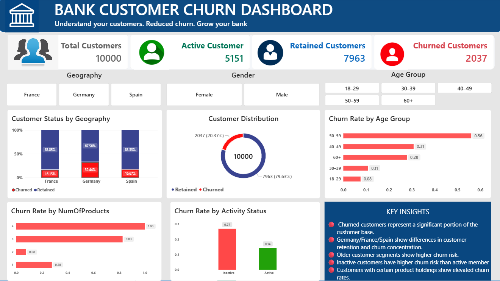
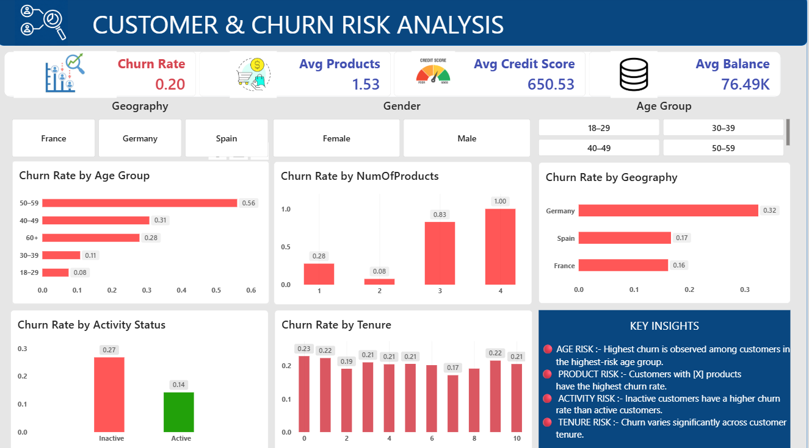
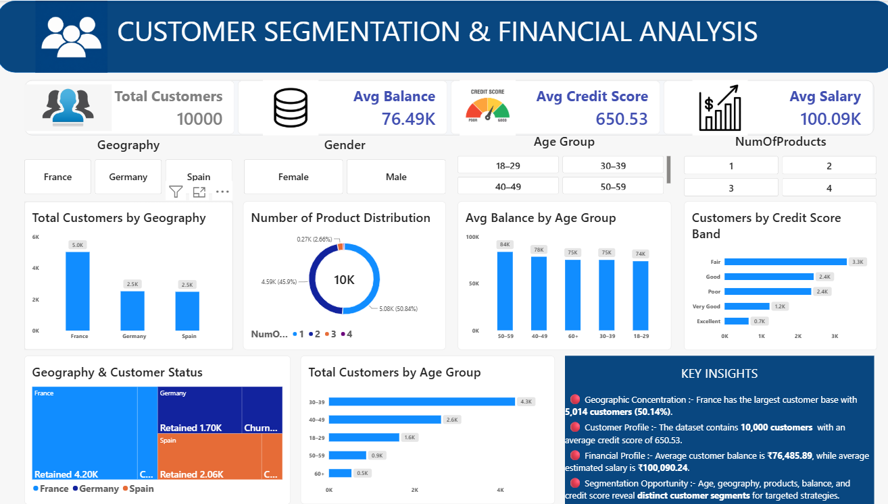

# Bank Customer Churn & Retention Analysis

An end-to-end **Data Analyst portfolio project** that analyzes customer churn in a banking dataset using **Python, MySQL, and Power BI**.

The project transforms raw customer data into cleaned analytical data, SQL-based insights, and an interactive Power BI dashboard to understand customer churn and identify segments that may require retention attention.

---
# 📊 Dashboard Preview

## Executive Dashboard



## Customer & Churn Risk



## Customer Insights


---

## 📌 Project Overview

Customer churn is an important business problem for banks because losing existing customers can affect long-term revenue and customer relationships.

This project analyzes **10,000 bank customer records** to understand:

- Overall customer churn
- Customer activity and engagement
- Geographic differences
- Demographic patterns
- Product usage
- Credit-card ownership
- Customer balance
- Credit score
- Age
- Tenure
- Estimated salary

The project follows a complete analytics workflow:

```text
Raw Data
   ↓
Python / Pandas
   ↓
Data Cleaning & Validation
   ↓
MySQL / SQL Analysis
   ↓
Power BI Dashboard
   ↓
Business Insights
   ↓
Retention Recommendations
```

---

## 🎯 Business Objectives

The main objectives of this project are to:

1. Calculate the overall customer churn rate.
2. Compare churn across different customer segments.
3. Analyze the relationship between customer activity and churn.
4. Examine churn by geography and gender.
5. Understand how product usage differs across customers.
6. Compare retained and churned customers using numerical attributes.
7. Identify customer segments that may require stronger retention strategies.
8. Present the findings through an interactive Power BI dashboard.

---

## 📊 Dataset

The dataset contains **10,000 customer records**.

The original dataset contained 14 columns. `RowNumber` and `Surname` were removed during preprocessing because they were not required for the analytical objectives.

### Final Dataset

| Column | Description |
|---|---|
| `CustomerId` | Unique customer identifier |
| `CreditScore` | Customer credit score |
| `Geography` | Customer country |
| `Gender` | Customer gender |
| `Age` | Customer age |
| `Tenure` | Number of years with the bank |
| `Balance` | Customer account balance |
| `NumOfProducts` | Number of banking products used |
| `HasCrCard` | Credit-card ownership indicator |
| `IsActiveMember` | Customer activity indicator |
| `EstimatedSalary` | Estimated customer salary |
| `Exited` | Churn indicator: 1 = churned, 0 = retained |

### Target Variable

`Exited`

- `0` → Retained customer
- `1` → Churned customer

---

## 🧹 Data Cleaning

Data cleaning was performed using **Python and Pandas**.

### Initial dataset checks

- Rows: **10,000**
- Columns: **14**
- Missing values: **None**
- Duplicate rows: **None**

### Cleaning steps

- Loaded the raw CSV dataset.
- Checked dimensions and data types.
- Checked missing values.
- Checked duplicate records.
- Removed `RowNumber`.
- Removed `Surname`.
- Verified `CustomerId` uniqueness.
- Checked categorical values.
- Reviewed numerical variables and distributions.
- Exported the cleaned dataset for SQL and Power BI.

### Final dataset

**10,000 rows × 12 columns**

---

## 🔎 Key Dataset Statistics

### Churn

| Metric | Value |
|---|---:|
| Total Customers | 10,000 |
| Retained Customers | 7,963 |
| Churned Customers | 2,037 |
| Overall Churn Rate | **20.37%** |

### Customer Activity

| Metric | Customers |
|---|---:|
| Active Members | 5,151 |
| Inactive Members | 4,849 |

### Credit Card

| Metric | Customers |
|---|---:|
| Has Credit Card | 7,055 |
| No Credit Card | 2,945 |

### Product Usage

| Products | Customers |
|---:|---:|
| 1 | 5,084 |
| 2 | 4,590 |
| 3 | 266 |
| 4 | 60 |

---

## 🛠️ Technologies Used

- **Python**
- **Pandas**
- **NumPy**
- **Matplotlib**
- **MySQL**
- **SQL**
- **Power BI**
- **DAX**
- **Jupyter Notebook**
- **VS Code**
- **Git / GitHub**

---

## 🐍 Python Analysis

Python was used for:

- Data loading
- Data inspection
- Data cleaning
- Duplicate checking
- Missing-value checking
- Data validation
- Exploratory data analysis
- Numerical and categorical analysis
- Preparing the cleaned dataset

Main libraries:

```text
pandas
numpy
matplotlib
```

---

## 🗄️ SQL Analysis

The cleaned dataset was imported into MySQL using the table:

```text
bank_customers
```

SQL was used to perform:

- Customer-level analysis
- Churn counts
- Churn-rate calculations
- Geographic analysis
- Gender analysis
- Activity-status analysis
- Product-level analysis
- Credit-card analysis
- Balance analysis
- Salary analysis
- Customer segmentation

The SQL queries are stored in the project's `SQL` folder.

---

## 📊 Power BI Dashboard

The Power BI dashboard contains **three analytical pages**.

### Page 1 — Customer Churn Overview

Provides a high-level overview of the customer base and churn situation.

Focus areas include:

- Total customers
- Churned customers
- Retained customers
- Overall churn rate
- Customer demographics
- High-level churn comparisons

---

### Page 2 — Customer Risk Insights

Focuses on customer characteristics associated with churn risk.

Key areas include:

- Customer activity
- Geography
- Product usage
- Credit-card ownership
- Customer status

One of the key calculated columns is:

```DAX
Activity Status =
IF(
    bank_customers[IsActiveMember] = 1,
    "Active",
    "Inactive"
)
```

This classification is used to compare churn behavior between active and inactive customers.

---

### Page 3 — Customer Profile Insights

Provides deeper analysis of customer profile characteristics.

Variables explored include:

- Age
- Balance
- Estimated Salary
- Credit Score
- Tenure
- Number of Products

This page complements the churn-focused pages by examining the underlying customer profile.

---

## 💡 Key Insights

### 1. Overall churn is significant

The dataset has a **20.37% churn rate**, meaning roughly one out of every five customers has exited.

### 2. Customer activity is an important retention dimension

Active and inactive customers can be compared to identify differences in churn behavior and engagement.

### 3. Most customers use one or two products

The majority of customers have either one or two banking products, while customers with three or four products represent a much smaller segment.

### 4. Customer characteristics should be analyzed together

Churn should not be attributed to a single variable. Factors such as activity, geography, age, balance, product usage, and credit score should be considered together when identifying customer-risk segments.

---

## 📌 Business Recommendations

### Improve engagement

Develop targeted engagement strategies for inactive customers.

### Monitor high-risk segments

Use customer characteristics to identify segments requiring additional retention attention.

### Encourage appropriate product engagement

Analyze product usage carefully and identify opportunities for relevant cross-selling or product adoption.

### Use customer segmentation

Create targeted retention strategies rather than applying the same approach to every customer.

### Develop predictive churn modeling

A future version of this project can use machine learning to predict the probability of customer churn.

Potential models include:

- Logistic Regression
- Decision Tree
- Random Forest
- Gradient Boosting

---

## 📁 Project Structure

```text
Bank Customer Churn & Retention Analysis/
│
├── data/
│   ├── raw/
│   │   └── Churn_Modelling.csv
│   │
│   └── processed/
│       └── bank_customer_churn_cleaned.csv
│
├── notebooks/
│   ├── 01_data_cleaning.ipynb
│   ├── 02_customer_analysis.ipynb
│   └── 03_churn_analysis.ipynb
│
├── SQL/
│   ├── 01_data_validation.sql
│   ├── 02_customer_analysis.sql
│   └── 03_churn_analysis.sql
│
├── powerbi/
│   ├── Bank churn dashboard.pbix
│   └── screenshots/
│
├── README.md
├── bank_churn_report.md
├── requirements.txt
└── .gitignore
```

> Update filenames in this structure if your local project uses different notebook, SQL, or Power BI filenames.

---

## 🚀 Project Workflow

### Step 1 — Data Cleaning

Raw customer data was loaded and cleaned using Pandas.

### Step 2 — Exploratory Analysis

Customer characteristics and churn patterns were explored using Python.

### Step 3 — SQL Analysis

The cleaned dataset was imported into MySQL and analyzed using SQL queries.

### Step 4 — Power BI

The cleaned dataset was loaded into Power BI to create an interactive three-page dashboard.

### Step 5 — Business Insights

The analysis was converted into customer-risk observations and retention recommendations.

---

## 📈 Project Outcome

This project demonstrates an end-to-end **Data Analyst workflow**:

```text
Data Collection
      ↓
Data Cleaning
      ↓
Exploratory Data Analysis
      ↓
SQL Analysis
      ↓
Data Visualization
      ↓
Business Insights
      ↓
Recommendations
```

It demonstrates practical skills in:

- Data cleaning
- Exploratory data analysis
- SQL
- MySQL
- Pandas
- Power BI
- DAX
- Data visualization
- Business analysis
- Customer segmentation
- Churn analysis

---

## 🔮 Future Improvements

Possible future extensions include:

- Customer churn prediction using machine learning
- Customer risk scoring
- Feature engineering
- Model evaluation and comparison
- Automated reporting
- Advanced customer segmentation
- Retention campaign simulation

---

